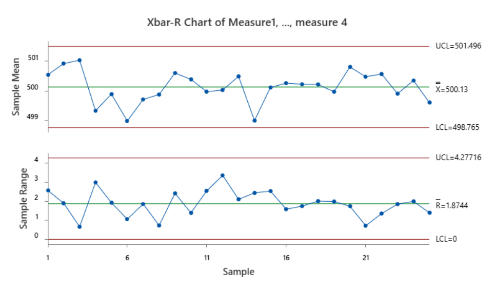
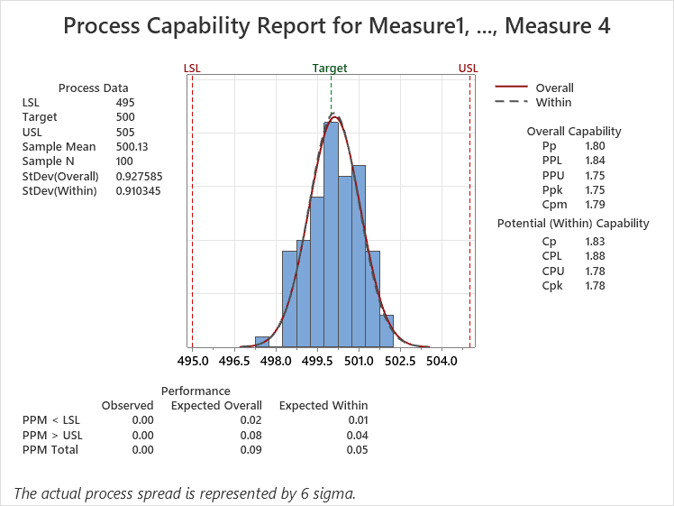
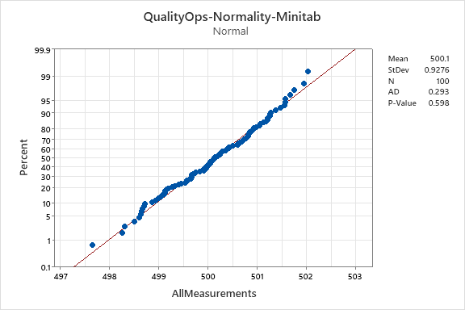

# Track C: Xbar-R and capability validation

## Scope

Track C validates the QualityOps `Rbar/d2` within-sigma estimator, three-sigma
Xbar-R limits, Test 1, and selected capability indices against Minitab 22.5.1
(64-bit). It uses the public synthetic dataset
`qualityops_spc_rbar_n4_v1`: 25 ordered subgroups of four observations.

The observations and subgroup structure were designed for controlled numerical
validation. They are not factory measurements and do not establish rational
subgrouping for any real process. The simulated specification assumptions are
LSL 495, target 500 and USL 505; they are not customer requirements.

## Integrity controls

- Dataset SHA-256:
  `2ce0338888071200dcf4835bd21b72dbdbedba8336a6491e5eb3a8c783cb866c`
- Minitab reference CSV SHA-256:
  `7e09bc4357c95e1bb1ccdfa30f1c5f183bc746cc1049af622fe6592be48b6c9d`
- Acceptance rule: absolute difference `<= 1e-9` using unrounded exports.
- Method: `within sigma = Rbar / d2(4)`, where `d2(4) = 2.059`.
- Control-chart test: Test 1 only, a point beyond three standard deviations.

The complete machine-readable provenance and screenshot hashes are recorded in
[`data/spc/manifest.json`](../data/spc/manifest.json). The Minitab project file
is intentionally not published because its container retains a local file path;
the safe CSV, method record and images contain the required numerical evidence.

## Reconciliation

| Metric | QualityOps | Minitab | Absolute difference | Result |
|---|---:|---:|---:|---|
| Grand mean | 500.1301300000000 | 500.1301299999999 | 1.14e-13 | Pass |
| Rbar | 1.8744000000000027 | 1.8744000000000023 | 4.44e-16 | Pass |
| Within sigma | 0.9103448275862082 | 0.9103448275862079 | 2.22e-16 | Pass |
| Overall sigma | 0.9275845209658024 | 0.9275845209658025 | 1.11e-16 | Pass |
| Xbar LCL | 498.76461275862070 | 498.76461275862056 | 1.14e-13 | Pass |
| Xbar UCL | 501.49564724137934 | 501.49564724137923 | 1.14e-13 | Pass |
| R LCL | 0 | 0 | 0 | Pass |
| R UCL | 4.277164137931041 | 4.27716413793104 | 8.88e-16 | Pass |
| Cp | 1.8308080808080784 | 1.8308080808080787 | 2.22e-16 | Pass |
| Cpk | 1.7831594696969642 | 1.7831594696970061 | 4.20e-14 | Pass |
| Pp | 1.7967814565634740 | 1.7967814565634739 | 2.22e-16 | Pass |
| Ppk | 1.7500184223749502 | 1.7500184223749908 | 4.06e-14 | Pass |
| Cpm | 1.7881467512164680 | 1.7881467512164682 | 2.22e-16 | Pass |

Both implementations reported zero Xbar Test 1 violations and zero R-chart
Test 1 violations. The largest difference is below `1.2e-13`, comfortably inside
the predefined `1e-9` tolerance.

## Current monitoring boundary

This is a Phase I validation: QualityOps estimates the center and control
limits from the same controlled subgroups that it evaluates. The public API
does not yet accept a frozen historical baseline and separate Phase II
monitoring data. Claims about ongoing or real-time process monitoring are
therefore out of scope.

## Assumption checks and evidence

Minitab's normal probability plot reported Anderson-Darling `AD = 0.293` and
`p = 0.598` at displayed precision. This does not reject normality at alpha
0.05 for this controlled dataset; it does not prove that future or production
data are normal.







## Reproduce with QualityOps

```bash
qualityops spc \
  --file data/spc/qualityops_spc_rbar_n4_v1.csv \
  --columns measure_1 measure_2 measure_3 measure_4 \
  --lsl 495 \
  --usl 505 \
  --target 500
```

Numerical agreement validates the implementation for the documented method and
reference dataset. Operational use still requires process knowledge, time order,
measurement-system adequacy and defensible rational subgroups.
