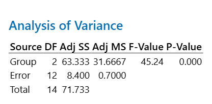
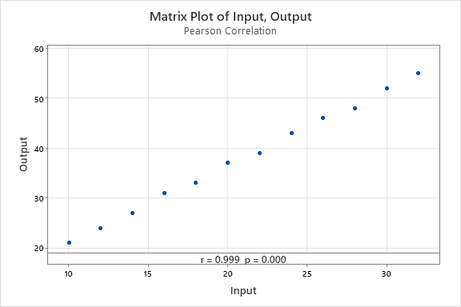
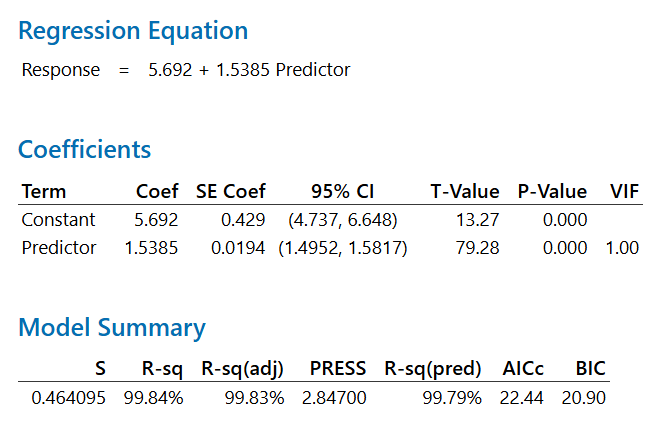

# Statistical validation against Minitab

## Purpose

This document records an independent reproducibility check of the
inferential statistical methods implemented in QualityOps.

The validation compares results produced by QualityOps in Python with
results displayed by Minitab using the same version-controlled datasets.

The validated methods are:

- One-way analysis of variance (ANOVA)
- Pearson product-moment correlation
- Ordinary least-squares simple linear regression

Small numerical differences are expected because Python reports more
decimal places than the Minitab output shown in the screenshots.

## Validation environment

- QualityOps version: 0.2.0
- Python implementation: repository `main` branch
- Reference software: Minitab 22.5.1 (64-bit)
- Validation date: 2026-08-10
- Significance level: 0.05
- Alternative hypothesis for Pearson and regression slope: two-sided

## Dataset integrity

The validation datasets are committed to the repository. Their SHA-256
hashes identify the exact files used during this comparison.

| Method | Dataset | SHA-256 |
|---|---|---|
| One-way ANOVA | `data/anova_validation.csv` | `2F000E8BE49E682E1CABBA58C406EAED9E31F2CB46ECC38EC0C8A3F082A14ADD` |
| Pearson correlation | `data/pearson_validation.csv` | `16B2CA4758B48B1E171312F3A958B1F13CD64425F63FC3B53027F798618A3C7C` |
| Simple linear regression | `data/regression_validation.csv` | `8EA91FCB4220A2859B441963C1E127934F81CA07C145BA92037FF4FA3080AD52` |

## Acceptance criteria

Results are accepted when:

1. Observation counts and degrees of freedom match exactly.
2. Statistics displayed by both tools agree within Minitab's displayed
   rounding precision.
3. Both tools produce the same statistical conclusion at alpha = 0.05.
4. Differences in displayed p-values caused by Minitab reporting
   `0.000` are interpreted as `p < 0.001`, not as a mathematically zero
   p-value.

## One-way ANOVA

Dataset: `data/anova_validation.csv`

The null hypothesis is that all population group means are equal. The
alternative is that at least one population mean differs.

| Result | QualityOps | Minitab | Comparison |
|---|---:|---:|---|
| Groups | 3 | 3 | Exact |
| Observations | 15 | 15 | Exact |
| DF between | 2 | 2 | Exact |
| DF within | 12 | 12 | Exact |
| SS between | 63.333333 | 63.33 | Agrees after rounding |
| SS within | 8.400000 | 8.40 | Agrees after rounding |
| MS between | 31.666667 | 31.67 | Agrees after rounding |
| MS within | 0.700000 | 0.70 | Agrees after rounding |
| F statistic | 45.238095 | 45.24 | Agrees after rounding |
| P-value | 2.578396e-06 | 0.000 | Both indicate p < 0.001 |

At alpha = 0.05, both implementations reject the null hypothesis. The
dataset provides strong evidence that at least one group mean differs.



## Pearson correlation

Dataset: `data/pearson_validation.csv`

The null hypothesis is that the population Pearson correlation is zero.
The alternative is that it is not zero.

| Result | QualityOps | Minitab | Comparison |
|---|---:|---:|---|
| Paired observations | 12 | 12 | Exact |
| Pearson correlation | 0.9992054933 | 0.999 | Agrees after rounding |
| P-value | 2.489793e-15 | 0.000 | Both indicate p < 0.001 |

At alpha = 0.05, both implementations reject the null hypothesis. The
validation dataset shows an extremely strong positive linear
association. This result does not establish causality.



## Simple linear regression

Dataset: `data/regression_validation.csv`

The fitted QualityOps equation is:

`Response = 5.6923077 + 1.5384615 Predictor`

| Result | QualityOps | Minitab | Comparison |
|---|---:|---:|---|
| Observations | 12 | 12 | Exact |
| Intercept | 5.6923077 | 5.6923 | Agrees after rounding |
| Slope | 1.5384615 | 1.53846 | Agrees after rounding |
| Slope standard error | 0.0194048 | 0.01940 | Agrees after rounding |
| R-squared | 0.9984116 | 99.84% | Agrees after unit conversion and rounding |
| Slope P-value | 2.489793e-15 | 0.000 | Both indicate p < 0.001 |

At alpha = 0.05, both implementations reject the null hypothesis that
the slope is zero. For this dataset, each additional predictor unit is
associated with an estimated response increase of approximately 1.538
units. This association does not establish causality.



## Reproduction commands

Run the following commands from the repository root after installing the
project dependencies.

### One-way ANOVA

```powershell
python -c "import pandas as pd; from qualityops.inferential import one_way_anova; df = pd.read_csv('data/anova_validation.csv'); groups = {name: group['Measurement'].tolist() for name, group in df.groupby('Group', sort=True)}; print(one_way_anova(groups))"


```

### Pearson correlation

```powershell
python -c "import pandas as pd; from qualityops.inferential import pearson_correlation; df = pd.read_csv('data/pearson_validation.csv'); print(pearson_correlation(df['Input'], df['Output']))"
```

### Simple linear regression

```powershell
python -c "import pandas as pd; from qualityops.inferential import simple_linear_regression; df = pd.read_csv('data/regression_validation.csv'); print(simple_linear_regression(df['Predictor'], df['Response']))"
```

### Automated test suite

```powershell
python -m unittest discover -v
```

## Conclusion

For all three validation datasets, QualityOps and Minitab produce
equivalent results within the numerical precision displayed by Minitab.
Observation counts, degrees of freedom, statistical conclusions, and
reported model quantities are consistent across both implementations.